# BaseImageAlgorithm

这里主要实现常见的图像处理，如鱼眼校正、高斯模糊、透明度、饱和度锐化、灰色填充、任意角度旋转等。这些算法是通过 Python 从底层实现的，每个算法的实现过程如下详细描述。

## 1. 透明度

图像由一系列像素组成，图像的原始颜色通过像素发光显示。图像每个像素的颜色由标准颜色 R、G 和 B 组成。因此，当图像经过算法处理时，实际上是对图像像素的 RGB 值进行重新计算和重组的过程。

通过算法处理图像的透明度时，实际上是在原图像上通过算法覆盖一层彩色遮罩。遮罩的颜色可以是任意的 RGB 组合。也就是说，对于一个图像 A，当它被一个遮罩 B 覆盖时，我们看到的图像 C 就是通过遮罩 B 看到的图像 A。因此，我们看到的实际上是图像 C 的 RGB 值。

所以我们要做的就是计算图像 C 的 RGB 值。

透明度混合算法：

```python
A(C) = (1-alpha)*A(B) + alpha*A(A)
R(C) = (1-alpha)*R(B) + alpha*R(A)
G(C) = (1-alpha)*G(B) + alpha*G(A)
B(C) = (1-alpha)*B(B) + alpha*B(A)
```

你也可以参考： https://www.cnblogs.com/kongqiweiliang/p/3773127.html

原始图像 1


原始图像 2


原始图像 1 和单色图像混合


原始图像 1 和图像 2 混合


## 2. 二值化

图像二值化，顾名思义，就是将图像的RGB颜色值转换为0或1，也就是说，图像仅由0和1组成。在电子技术领域，0表示关闭，1表示开启；对于像素，0表示不显示，1表示显示。因此，经过二值化操作后的图像仅由黑白组成。这在机器视觉中被广泛使用，因为对于计算机来说，它们只能处理0-1数据，并不需要知道图像的颜色，它们只需要知道图像的轮廓，因此知道0和1就足够了。

在执行二值化操作之前，我们必须先进行另一个操作，也就是将图像转换为灰度图。为什么需要这样的操作？

这里我将谈到图像的维度。对于一张照片，它是由一系列像素组成的，因此当我们想要控制某个像素时，可以通过行和列传达索引，例如 [x, y]，但仅有x和y是不够的，为什么？因为x和y只是描述了这个像素的位置，而没有描述该像素的颜色。因此我们还需要引入一个z，用z来指定颜色值，并用颜色值描述像素的颜色。所以有了 [x, y, z]，表示该像素的位置是 [x, y]，颜色是z。因此，描述构成彩色照片的一个像素需要使用三维数据来表示。所以对于彩色图片，它是一个三维数据矩阵。因此，将图片处理成灰度可以减少图像的颜色维度。

灰度填充算法：

```python
gray = 0.299 * r + 0.587 * g + 0.114 * b
```

> 这是一个心理学公式，但它也可以用来将图像处理为灰度，这很有趣，r、g、b 表示原始图像像素中标准红、绿、蓝像素的占比。

原始图像


处理后图像


图像处理为灰度后，没有颜色，也就是说 R = G = B = gray，因此彩色照片的颜色维度也被降低，这也类似于按比例混合，将彩色照片的 RGB 值按 0.299:0.587:0.114 的比例混合。

好了，一切都很容易处理。颜色处理为灰度后，图像的颜色只剩下深浅，这时我们可以设置一个阈值，将大于阈值的像素值设为 255，使其呈现白色，小于阈值的像素值设为 0，使其呈现黑色。颜色值只有 0 或 255，这非常好。原本的彩色图像瞬间就变成了黑白图像。

```python
if imagematrix[i, j] > threshold:
    new[i, j] = 255
else:
    new[i, j] = 0
```

你觉得没问题，我之前说过，在计算机图像识别中，计算机只认识 0 和 1，但现在图像矩阵中的数值是 0 和 255，所以不用担心，我们会把图像的每个数据值除以 255，这样图像矩阵的值就会被处理成 0 和 1。

处理后图像

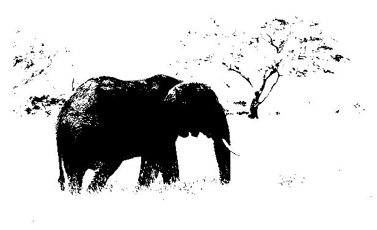

## 3. 高斯模糊

模糊在 UI 特效中被广泛使用，例如 iOS、Android、MIUI、Windows 操作系统。当然，模糊在图像滤镜中也起着重要作用，而高斯模糊是模糊算法中最广泛使用的一种。高斯模糊主要以数学家高斯命名。高斯模糊主要利用高斯分布（正态分布）进行图像模糊处理。让我们仔细分析高斯模糊算法的实现过程。

所谓 “模糊”，可以理解为对每个像素点周围像素的平均值。

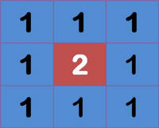

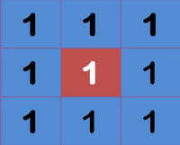

这就是效果，周围点的平均值将为 1

在计算平均值时，周围像素范围越大，模糊效果越强


一维正态分布的权重

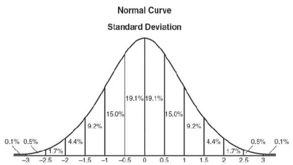

根据数值之间的关系，正态分布显然是一种理想的权重分布方式。在图上，正态分布呈钟形曲线，越靠近中心，数值越大；离中心越远，数值越小。
在计算平均值时，我们只需要以“中心点”为原点，根据其他点在正态曲线上的位置赋予权重，就可以得到加权平均值。

上图中的正态分布是一维的，但对于一张图像，它是有行列的平面，因此我们需要二维正态分布图像

一维正态分布的权重

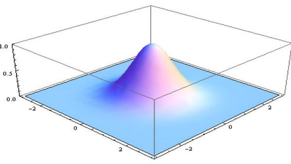

### 3.1 高斯函数

一维高斯函数

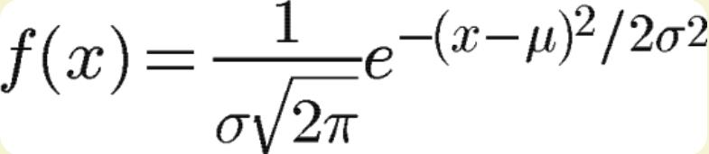

其中 μ 是 x 的均值，σ 是 x 的方差。由于在计算平均值时中心点为原点，因此 μ 等于 0。
所以公式如下：

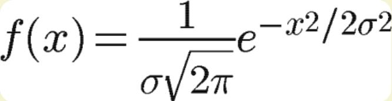

3.2 二维高斯函数

根据一维高斯函数，可以推导出二维高斯函数：

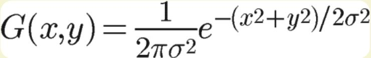

好了，有了这个二维高斯函数，我们可以进行下一步操作。

### 3.2 权重矩阵

假设中心点的坐标为 [0, 0]，则距离其最近的 8 个点的坐标如下：

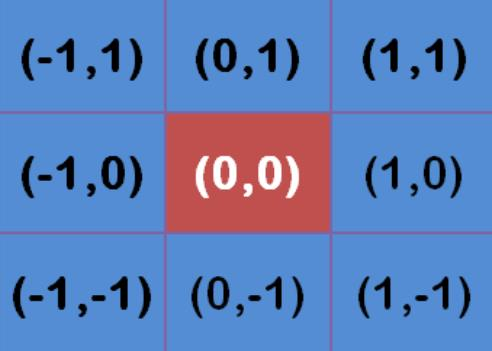

现在我们需要计算权重矩阵。为了计算权重矩阵，我们需要设定 σ 的值。假设 σ = 1.5，则模糊半径为 1 的权重矩阵如下：

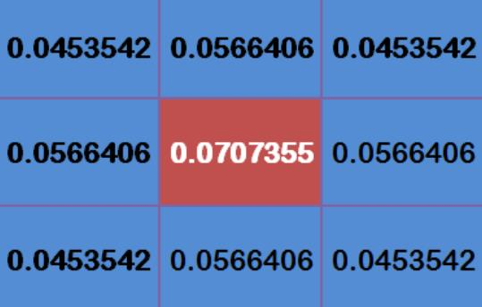

这 9 个点的权重和为 0.4787147。如果仅计算这 9 个点的加权平均值，则它们的权重和必须等于 1。因此，上述 9 个值需除以 0.4787147，得到最终的权重矩阵。

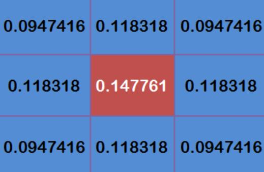

### 3.3 计算高斯模糊

权重矩阵已计算完成，现在我们可以计算所需的高斯模糊值。
如果现在有 9 个像素，它们的值范围是 0 到 255，其值如下图所示：

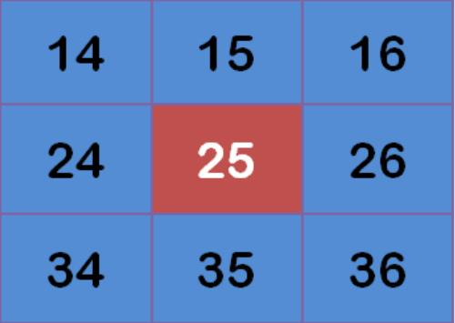

现在我们将这些像素乘以各自的权重值，其权重值如下：

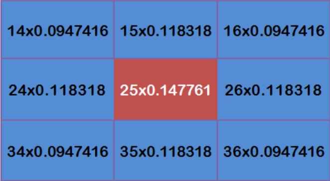

然后得到下图所示的值。

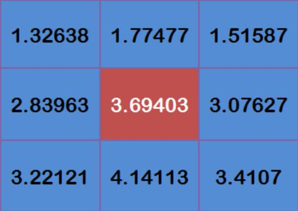

这里得到 9 个值，将计算出的 9 个值相加即可得到中心像素的颜色值。我们重复上述计算，为图像的所有像素取值，就能得到高斯模糊图像。

原始图像


处理后图像


